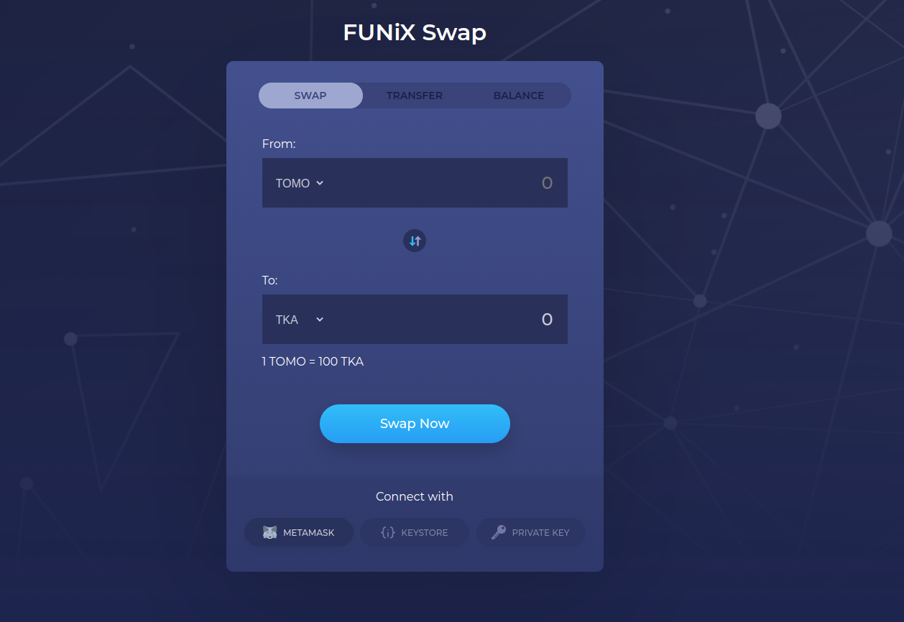

# FUNiX Swap
FunixSwap is a decentralized application built on blockchain technology that enables users to exchange various tokens with one another and transfer tokens to other users without relying on a centralized exchange.



## Features
- Swap tokens
- Transfer tokens to other addresses
- View token balance

The application is deployed on TomoChain testnet at [https://funix-swap.vercel.app/](https://funix-swap.vercel.app/) using Vercel automatic deployment.

## Requirements

- [Node.js](https://nodejs.org/en/download/)
- [React](https://reactjs.org/docs/getting-started.html)
- [Solidity](https://solidity.readthedocs.io/en/v0.8.0/installing-solidity.html)
- [Truffle](https://www.trufflesuite.com/truffle)
- [Ganache](https://www.trufflesuite.com/ganache)
- [Metamask](https://metamask.io/)

## Installation

1. Clone the repository

```bash
git clone https://github.com/DAN3002/FUNiX-Swap.git
```

2. Install dependencies

```bash
npm install
```

## Development
### Run on local network
1. Run Ganache
```bash
npm run ganache
```

2. Compile and migrate smart contracts
```bash
npm run migrate:dev
```

3. Update the contract address in `src/config.js`
4. Start frontend
```bash
cd front-end
npm run start
```
5. You can now access the application at `http://localhost:3000`

### Run on tomochain testnet
1. Create a [TOMO wallet](https://wallet.testnet.tomochain.com/).
2. Get some TOMO from [TomoChain faucet](https://faucet.testnet.tomochain.com/).
3. Create a `.secret` file in the root directory and put your mnemonic phrase in it.
4. Compile and migrate smart contracts
```bash
npm run migrate:tomodev
```
5. Update the contract address in `src/config.js`
6. Start frontend
```bash
cd front-end
npm run start
```
7. You can now access the application at `http://localhost:3000`

### Test smart contracts
The test script using Truffle and Ganache to run the test cases. Make sure you have Ganache running before running the test script.
```bash
npm run test
```

## Owner
- [DAN3002](https://github.com/DAN3002)
